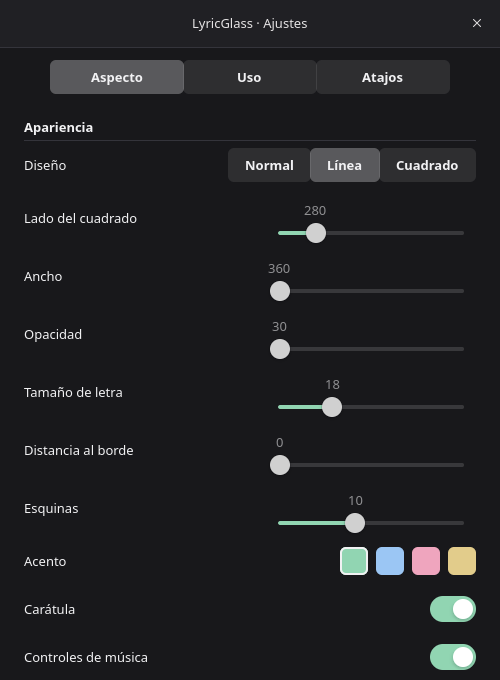

# LyricGlass

A native Spotify lyrics overlay for Linux, Wayland and Niri. Rust, GTK4 and a
real `gtk4-layer-shell` overlay surface. No browser runtime, account tokens or
Spotify Web API credentials. The application interface is in Spanish.

Album art, three animated lyric lines, transport controls, a seekable progress
bar, live preferences and compositor shortcuts keep music within reach while
working or playing. Game mode makes the overlay transparent to pointer input.
The overlay never takes keyboard focus. Settings take input only when opened.

## Build and run

On Arch Linux:

```sh
sudo pacman -S --needed base-devel rust gtk4 gtk4-layer-shell pkgconf dbus
cargo build --release
cargo run --release
```

Rust 1.92+, GTK 4.12+, GLib 2.80+ and the **C library** gtk4-layer-shell are
required. The Rust bindings do not replace the system library. Check with
`pkg-config --modversion gtk4 gtk4-layer-shell-0`. Niri 26.04 is the tested target.
Run in your normal Wayland user session, not with sudo. Native Spotify and its
Flatpak build work when they expose MPRIS on the user session bus.

To install locally:

```sh
install -Dm755 target/release/lyricglass ~/.local/bin/lyricglass
install -Dm644 data/io.github.lyricglass.LyricGlass.desktop ~/.local/share/applications/io.github.lyricglass.LyricGlass.desktop
~/.local/bin/lyricglass install-shortcuts
```

Run `install-shortcuts` again after moving the executable: it records the full
binary path, so Niri does not depend on a shell's PATH. From the source checkout
you can instead run `target/release/lyricglass install-shortcuts` directly.

## Shortcuts and live settings

| Default | Action |
| --- | --- |
| F7 | Hide / show |
| Shift+F7 | Open preferences |
| Ctrl+F7 | Toggle click-through game mode |
| Ctrl+F8 | Play / pause |
| Ctrl+F9 | Previous track |
| Ctrl+F10 | Next track |

These shortcuts require Niri 26.04+ and the one-time `install-shortcuts` command, or the
**Aplicar atajos en Niri** button in preferences. Niri captures global shortcuts
even while a game has focus. `allow-inhibiting=false` also keeps them active
when a client inhibits shortcuts. Pick keys that do not conflict with your game.
Blank shortcut fields disable individual bindings.

Preferences have three tabs: appearance, usage and shortcuts. Choose Normal,
Line or Square. The square defaults to 280 x 280 px, with a configurable side
length and a wrapping current lyric. Customize background opacity, font size,
corners, accent swatch, artwork, transport controls and progress visibility.
Position, monitor, motion, idle visibility and click-through also update live.
Use Shift+F7 to reopen settings when clicks pass through.

Drag the four-arrow handle to place the overlay freely on the selected monitor.
Its position is saved after releasing the pointer and restored on the next run.
In Usage, **Colocar libremente** disables click-through for placement;
**Centrar arriba** returns to the default anchor. Free mode uses layer-shell
exclusive zone -1 to measure margins from the monitor edges while reserving no
workspace space. Select another monitor in preferences to move between outputs.
Playback controls include previous/next, play/pause, volume and ten-second seeks.
The progress bar seeks within the current track. Controls depend on the
capabilities reported by Spotify. MPRIS does not provide playlist management,
library search or liking tracks; use Spotify for those actions.

Lyric offset is in milliseconds: positive values advance the lyrics, negative
values delay them. This adjustment is global. Plain lyrics open in a selectable,
scrollable view via the list icon; they are never given invented timestamps.

Settings are saved atomically in `$XDG_CONFIG_HOME/lyricglass/config.json`
(normally `~/.config/lyricglass/config.json`). Malformed files fall back to defaults.
The shortcut installer validates the full candidate Niri configuration before
adding an include. It preserves existing text and creates
`~/.config/niri/config.kdl.before-lyricglass` when first adding the include.
Conflicting or invalid keys are reported without installing the candidate.

Commands target one application instance, including while the overlay is hidden:

```sh
lyricglass toggle
lyricglass settings
lyricglass game-mode
lyricglass play-pause
lyricglass next
lyricglass previous
lyricglass seek -10
lyricglass volume 50
lyricglass layout square
lyricglass layout normal
lyricglass move
lyricglass position 120 180
lyricglass reset-position
lyricglass status
lyricglass quit
```

`lyricglass demo` starts a presentation with original sample lines if no instance
is running. Exit the real instance first. Demo mode does not change Spotify.

## Niri glass effects

**Liquid Glass** is selectable in Appearance with live reflection intensity,
curvature and refraction controls. Highlights follow the pointer; reduced motion
is honored. Normal, Line and Square share the material. The optional
[native compositor integration](compositor/README.md) adds actual background
refraction, installed separately from Niri. Stock Niri uses native blur and
glossy highlights without pretending to refract.

```sh
lyricglass material liquid --refraction 6
lyricglass material frosted
```

The app supplies transparency and rounded GTK geometry. It does not render fake
background blur. The shortcut installer also enables the rules below on Niri
26.04+. For a manual installation, use `data/niri-effects.kdl` or this snippet:

```kdl
layer-rule {
    match namespace="^lyricglass$"
    geometry-corner-radius 10
    background-effect {
        blur true
        xray false
    }
    shadow {
        on
        softness 18
        spread 0
        offset x=0 y=4
        color "#00000055"
    }
}
```

Run `niri validate` after changes. Older Niri versions may not support
`background-effect`; remove that block on versions before 26.04. Niri's
`geometry-corner-radius` affects its shadow, while GTK draws the actual corners.
The main namespace is `lyricglass`; preference/lyrics windows use
`lyricglass-settings`. Main surface: overlay layer, no keyboard focus, exclusive
zone zero, top center with a 16px margin by default.

References: [Niri layer rules](https://niri-wm.github.io/niri/Configuration:-Layer-Rules.html),
[Niri key bindings](https://niri-wm.github.io/niri/Configuration:-Key-Bindings.html),
[gtk4-layer-shell](https://docs.rs/gtk4-layer-shell/0.8.1/gtk4_layer_shell/).

## Lyrics, playback and cache

Spotify supplies metadata, playback state, artwork URL and position through
MPRIS. LyricGlass discovers Spotify bus names dynamically, observes owner changes,
`PropertiesChanged` and `Seeked`, and resynchronizes every two seconds. A monotonic
local clock drives smooth progress between updates. Closing or restarting Spotify
does not close the overlay. HTTP, file operations and image decoding run off GTK's
main thread; artwork and lyrics from previous tracks are discarded.

Lyrics come from [LRCLIB](https://lrclib.net/docs), using title, first artist,
album and duration. Spotify's documented public API does not expose its lyrics.
Consequently these may differ from the version visible inside Spotify, and
coverage is not guaranteed. No Premium requirement is introduced by LyricGlass.

Synced lyrics support hundredth/millisecond timestamps, repeated tags, simultaneous
lines, global LRC offsets, instrumental gaps and malformed input. Synchronization
is line-based, not word-by-word karaoke. Very long lines are ellipsized in the
compact overlay; their full text is available on hover and in the complete view.

Cache: `$XDG_CACHE_HOME/lyricglass/` (normally `~/.cache/lyricglass/`), with
`lyrics/` JSON records and `artwork/` image files. Successful records expire after
30 days; missing results after six hours. Stale successful lyrics work offline.
The retry button bypasses freshness but respects server throttling. Corrupt cache
files are ignored and replaced. HTTP has a five-second connection timeout and
twelve-second total timeout, bounded response sizes and `Retry-After` handling.
Cache files can be deleted while the app is stopped. There is no automatic size
eviction yet. Requests identify the app as an unpublished local LyricGlass build;
add a public project/contact URL to the User-Agent before distributing a release.

## Autostart

Either add `spawn-at-startup "/home/YOUR_USER/.local/bin/lyricglass"` to Niri, or
use the included user service (do not enable both):

```sh
install -Dm644 data/lyricglass.service ~/.config/systemd/user/lyricglass.service
systemctl --user daemon-reload
systemctl --user enable --now lyricglass.service
```

The systemd user environment must contain `WAYLAND_DISPLAY` and
`XDG_CURRENT_DESKTOP`, normally imported by the Niri session setup.

## Troubleshooting

- No overlay: check `echo "$WAYLAND_DISPLAY"`, `niri msg layers`, and
  `lyricglass show`. Disable idle auto-hide in settings when testing without music.
- No Spotify: inspect `busctl --user list` for `org.mpris.MediaPlayer2.spotify*`.
  Browser Spotify generally does not expose the native Spotify MPRIS service.
- F7 does nothing: run the shortcut installer and `niri validate`; check that the
  generated path still points to the executable. Existing conflicting bindings
  must be changed before installing.
- Cannot click: Ctrl+F7 disables game mode; Shift+F7 opens settings independently.
- No blur: enable the provided layer rule and check Niri's global blur is not off.
- Lyrics out of sync: try the offset control; live/remastered versions can have
  different timings. Seeking should immediately choose the corresponding line.
- Network failures: cached lyrics continue to work; retry from preferences.
- Logs: `RUST_LOG=lyricglass=debug lyricglass` or
  `journalctl --user -u lyricglass.service`.

## Verification

```sh
cargo fmt --check
cargo check
cargo clippy --all-targets --all-features -- -D warnings
cargo test
cargo build --release
```

Unit tests cover parsing, clock behavior, fallback states, cache reads and settings
validation. The MPRIS integration test starts its own private D-Bus daemon; it
does not control your running Spotify. Native visual verification requires a
Wayland compositor; there is no X11 or browser rendering fallback.

## Screenshots




Native captures from the verified local session are stored in `docs/`. Run
`lyricglass demo` for a repeatable preview without network lyrics. The diagnostic
command `lyricglass capture /absolute/path.png` renders only the overlay widget,
without capturing other applications or the compositor's background blur.

## License

The GTK app is MIT. The optional compositor is GPL-3.0-or-later with third-party
notices in `compositor/`. Lyrics and album artwork remain their owners' property.
