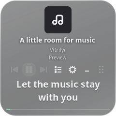
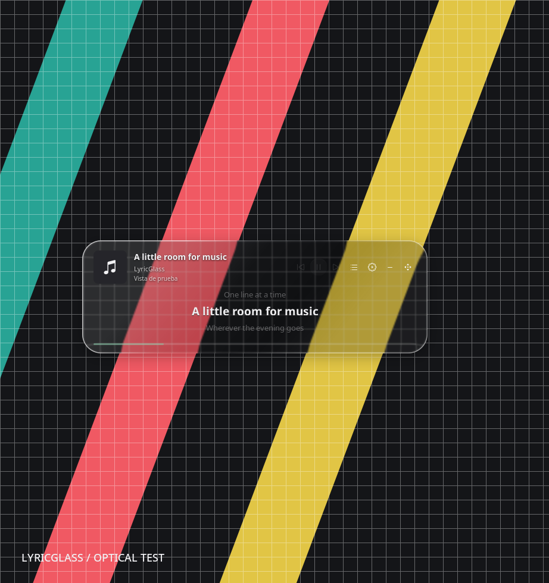

# LyricGlass

A native Spotify lyrics overlay for Linux. Rust and GTK4, with a real Wayland
layer surface where supported and a native X11 backend. No browser runtime,
Spotify account tokens or Web API credentials.



## At a glance

- Spotify detection, playback controls, seeking, volume and synchronized lyrics.
- Normal, single-line and compact square layouts, with saved free positioning.
- Glass, Dark, Light, High Contrast and Minimal styles.
- Live typography, color, transparency, motion and visibility settings.
- English by default, with Spanish and Simplified Chinese available immediately.
- F7 hide/show, configurable shortcuts and click-through game mode.
- User-session service and login startup enabled by the installer.
- Local lyrics/artwork cache, offline fallback and settings import/export.

## Install

Requires **Rust 1.92+, GTK 4.12+ and GLib 2.80+**. On Arch Linux:

```sh
sudo pacman -S --needed base-devel rust gtk4 gtk4-layer-shell pkgconf dbus
./scripts/install.sh
~/.local/bin/lyricglass
```

The installer builds a release binary, installs an application-menu entry and
enables automatic startup at **graphical login**. Run it as your normal user,
not root. Use `./scripts/install.sh --no-autostart` to opt out.

On Niri, install global shortcuts once:

```sh
~/.local/bin/lyricglass install-shortcuts
```

[Installation](docs/INSTALLATION.md) covers Debian, Ubuntu, Fedora, optional
layer-shell builds, updates, service management and removal.
[Desktop compatibility](docs/COMPATIBILITY.md) explains what each backend can do.

## Everyday controls

| Default key | Action |
| --- | --- |
| F7 | Hide / show |
| Shift+F7 | Preferences |
| Ctrl+F7 | Click-through game mode |
| Ctrl+F8 | Play / pause |
| Ctrl+F9 | Previous track |
| Ctrl+F10 | Next track |

On X11, the app registers these keys itself. On Niri, use the shortcut installer.
On other Wayland desktops, assign the corresponding CLI commands in your desktop
settings. Key conflicts are reported; empty shortcut fields disable a binding.
Exclusive game input may affect shortcuts depending on the desktop.

Drag the grip to position the overlay, or open Preferences to change its monitor,
anchor or coordinates. The square can be 240-440 px per side. Position locking
prevents accidental moves. Preferences remain accessible through the command line
even when the overlay is hidden or click-through.

```sh
lyricglass settings
lyricglass layout square
lyricglass style light
lyricglass language es
lyricglass move
lyricglass position 120 180
lyricglass reset-position
lyricglass toggle
lyricglass game-mode
lyricglass status
```

See [Configuration](docs/CONFIGURATION.md) for the complete controls, defaults,
backups and keyboard commands.

## Liquid Glass

Glass uses native transparency, rounded geometry and moving highlights. The
optional [compositor integration](compositor/README.md) adds real background
refraction through a separately installed Niri build.



The preview above includes the actual compositor effect. Widget-only screenshots
do not capture the background. Stock Niri can provide blur and shadows; other
desktops depend on their compositor. **The full refraction effect is not available
on every desktop.** Installing LyricGlass does not replace your compositor or
switch your session.

```sh
lyricglass material liquid --refraction 6
lyricglass material frosted
```

## Lyrics and privacy

Spotify supplies track metadata, position, artwork URLs and playback controls
through the local [MPRIS interface](https://specifications.freedesktop.org/mpris-spec/latest/).
Lyrics come from [LRCLIB](https://lrclib.net/docs), not Spotify's private lyric
service. Their timing or content can differ from Spotify, and some songs have no
match. No Premium requirement is introduced by LyricGlass.

Synchronization is line-based. Plain lyrics remain selectable and scrollable;
the app does not invent timestamps or word-by-word karaoke. A positive lyric
offset advances the displayed lyrics; a negative value delays them.

Lyric requests send title, artist, album and duration to LRCLIB. Artwork is fetched
from the URL reported by Spotify. There is no account login or telemetry.
Successful cache records last 30 days, missing results six hours; stale successful
lyrics remain usable offline. Cache files are bounded individually, but there is
not yet an automatic total-size eviction policy.

## Development

```sh
cargo fmt --check
cargo clippy --all-targets --all-features -- -D warnings
cargo test
cargo test --test x11 -- --ignored
cargo build --release --locked
```

The X11 test requires Xvfb and uses its own display and D-Bus daemon. The MPRIS
test also uses a private bus and never controls your Spotify.
[Development](docs/DEVELOPMENT.md) describes the architecture and test workflow.
[Verification](docs/VERIFICATION.md) records tested behavior and remaining gaps.

## Troubleshooting

- **Nothing visible:** run `lyricglass show`; check idle/paused visibility and
  `lyricglass status`. Launch inside your graphical session, never with sudo.
- **No Spotify:** check `busctl --user list` for
  `org.mpris.MediaPlayer2.spotify*`. Native and Flatpak Spotify must expose
  MPRIS on the same session bus. Browser Spotify is not a supported source.
- **F7 does nothing:** resolve key conflicts. On Niri, rerun the shortcut installer
  after moving the executable. On other Wayland desktops, bind the command manually.
- **Cannot click:** `lyricglass game-mode` toggles click-through off;
  `lyricglass settings` opens preferences separately.
- **Panel inaccessible:** `lyricglass recover` restores visible, unlocked controls
  without resetting appearance, language or login startup.
- **Lyrics drift:** adjust the offset; live and remastered versions may have
  different timings. Retry the lookup from preferences.
- **No blur:** transparency alone does not create blur. Check compositor rules
  and the [compatibility notes](docs/COMPATIBILITY.md).
- **Startup problems:** `journalctl --user -u lyricglass.service -b`.
  See the [installation guide](docs/INSTALLATION.md#automatic-startup).

## License

The application is MIT. The optional compositor is GPL-3.0-or-later and retains
its third-party notices in `compositor/`. Lyrics and artwork remain their
respective owners' property.
